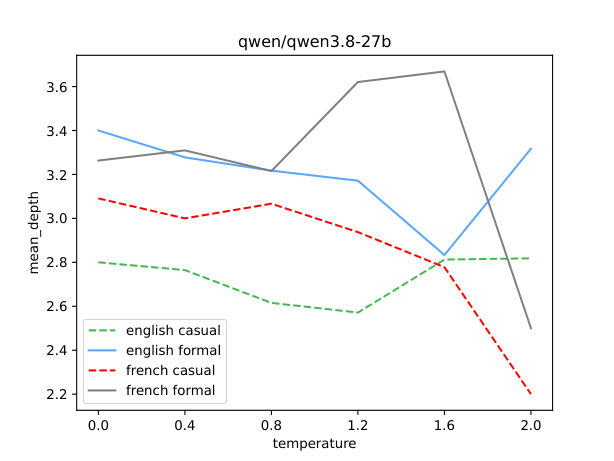

Impact of generation Temperature on the Syntactic Complexity of LLM-generated texts

A computational linguistics study evaluating the impact of sampling temperature on syntactic complexity, tree depth, and Mean Dependency Distance (MDD) in generations from two open-weight LLMs in English and French.


## Research Question

How does sampling temperature affect syntactic complexity and dependency tree structures in analytical languages?

Higher sampling temperatures are known to increase lexical variation. Their structural effects on dependency trees remain unstudied. This project quantifies changes in sentence-level tree depth and governor-dependent distance across six temperature settings, in English and French.


## Experimental Design

The experiment processes a balanced corpus of $N = 144$ generated texts ($2 \times 2 \times 2 \times 6 \times 3$):

| Factor | Values / Levels |
| :--- | :--- |
| **LLM Architectures** | `openai/gpt-oss-20b`, `qwen/qwen3.8-27b` (Groq API) |
| **Target Languages** | English (`en`), French (`fr`) – analytical SVO languages |
| **Prompt Registers** | `formal` (official announcement), `casual` (informal post) |
| **Temperatures ($T$)** | $0.0, 0.4, 0.8, 1.2, 1.6, 2.0$ |
| **Seeds per Cell** | `1, 2, 3` (3 iterations per parameter combination) |


## Syntactic Metrics

For every parsed sentence, the pipeline computes:

1. **`mean_depth`** – average node depth relative to the root in the sentence dependency tree.
2. **`max_depth`** – maximum depth (height) of the dependency tree.
3. **`mdd`** (Mean Dependency Distance) – mean governor-dependent distance over all non-root tokens:

$$\text{MDD} = \frac{1}{N_{\text{non-root}}} \sum_{i,\ \text{head}(i) \neq 0} \left| i - \text{head}(i) \right|$$


4. **`length`** – sentence length in tokens, used as a control variable.


## Preliminary Observations

**Note:** these are descriptive median trends across experimental cells. Statistical significance and confidence intervals have not yet been evaluated – patterns below are hypotheses, not findings.

- `qwen/qwen3.8-27b` shows a sharp collapse in syntactic complexity at $T=2.0$, especially for French: median mean_depth drops to 2.20 (French casual) and 2.50 (French formal), while English remains near 2.6–3.3.
- For `openai/gpt-oss-20b` no systematic trend is apparent: mean_depth fluctuates within a narrow band (2.8–3.3) without a clear direction across temperatures.


*Figure 1: Median Mean Dependency Depth vs. sampling temperature, by language and prompt register.*


## Technical Implementation

- **Metadata persisted as CoNLL-U comments:** generation parameters (`model`, `language`, `prompt_type`, `temperature`, `seed`, `record_id`) are written directly to `# key = value` CoNLL-U sentence headers during parsing, so `pyconll` can extract them later.
- **Markdown stripping:** headers and formatting (`**`, `#`) are removed via regular expressions before passing text to Stanza, to avoid parser artifacts.
- **Ellipsis node filtering:** enhanced dependency empty nodes (e.g., ID `5.1`, where `head is None`) are excluded from depth and MDD calculations.
- **Deterministic decoding at $T=0.0$.** With greedy decoding the three seed runs produce identical strings. That cell gives one unique observation, not three independent ones.
- **API handling:** rate-limit delay throttling (`time.sleep`) and model-specific `reasoning_effort` settings (`low` for `gpt-oss`, `default` for `qwen3.8`) for the Groq API endpoint.


## Repository Structure

```text
.
├── configs/
│   ├── grid.yaml                 # Parameter matrix configuration
│   └── prompts/                  # System prompts
├── results/
│   ├── llm_output/               # Raw JSONL API outputs
│   ├── parsed/                   # Output CoNLL-U dependency trees
│   ├── metrics/                  # Computed metrics.csv
│   └── analysis/                 # Tables (PDF)
├── src/
│   ├── 01_generate_texts.py      # Groq API generation script
│   ├── 02_parse_output.py        # Stanza dependency parser script
│   ├── 03_compute_metrics.py     # Tree metric extraction script
│   └── 04_pandas_analyser.py     # Visualization script
├── .env.example                  # Environment template
├── requirements.txt              # Python dependencies
└── README.md
```


---


## How to Reproduce

### 1. Environment setup

```bash
# Clone the repository
git clone https://github.com/VladislavTrufanov/llm-temperature-syntax-complexity
cd llm-syntactic-complexity

# Create and activate a virtual environment
python -m venv venv
source venv/bin/activate  # Windows: venv\Scripts\activate

# Install dependencies
pip install -r requirements.txt

# Configure the API key
cp .env.example .env
# Open .env and insert your GROQ_API_KEY
```

### 2. Pipeline execution

Run the stages in sequence:

```bash
python src/01_generate_texts.py
python src/02_parse_output.py
python src/03_compute_metrics.py
python src/04_pandas_analyser.py
```

---


## Limitations

- **Parser sensitivity:** cross-lingual comparisons depend on how well Stanza parses each language.
- **Statistical testing:** the current analysis relies on point medians, without confidence intervals or inferential hypothesis testing.
- **Typological scope:** restricted to analytical SVO languages (English and French). Results do not generalize to other languages.

At the time of generation (14 September 2026) models qwen/qwen3.8-27b (version by August 17, 2026) and openai/gpt-oss-20b (version by August 5, 2025) were used. Results may differ upon a later models update.


## References

Liu, H., Xu, C., & Liang, J. (2017). Dependency distance: A new perspective on syntactic patterns in natural languages. *Physics of Life Reviews*.

Qi, P., Zhang, Y., Zhang, Y., Bolton, J., & Manning, C. D. (2020). Stanza: A Python Natural Language Processing Toolkit for Many Human Languages. *ACL 2020 System Demonstrations*.

pyconll library: https://pyconll.github.io/
Groq API documentation: https://console.groq.com/docs
